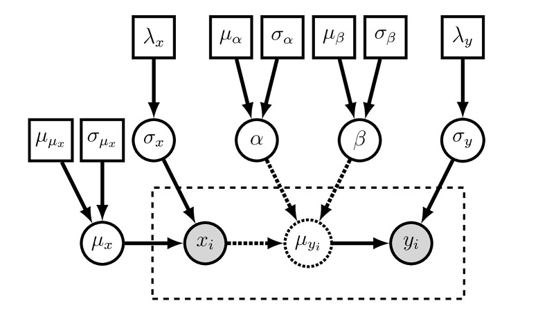

```{r setup, include=FALSE,echo=FALSE}
knitr::opts_chunk$set(warning=FALSE)
knitr::opts_chunk$set(dev='pdf')
knitr::opts_chunk$set(echo = TRUE)
knitr::opts_chunk$set(cache=TRUE)
knitr::opts_chunk$set(tidy=TRUE)
knitr::opts_chunk$set(prompt=FALSE)
knitr::opts_chunk$set(message=FALSE)
knitr::opts_chunk$set(comment=NA)
knitr::opts_chunk$set(fig.pos = 'H')
```

```{r echo=FALSE,results='hide',message=FALSE}
library(papeR)
library(sqldf)
library(hexbin)
library(knitr)
library(pander)
library(latex2exp) 
library(ggplot2)
library(GGally)

chains = 4
iter = 2000
warmup = 500
```

##Bayesian Approaches to Count Regression 

Please see the intorduction to count regression post for a review of count models from the maximum likelihood point o f view. Here we look to replicate the some of same models from a Bayesian persepctive.  We also start our exploration of hierarchical models with an example of a hierarchical zero inflated model. Part III of this series will go more into mixed effects and hierarchical models. 

We introduce plate notation here. This is a graphical depiction of the static and probablistic dependiencies in a Bayesian model. 
The symbols for a visual representation of a graphical model are;
a) Solid squares represent constant nodes, which specify fixed- valued variables. 
b) Stochastic nodes are represented by solid circles. These variables correspond to random variables and may depend on other variables. 
c) Deterministic nodes (dotted circles) indicate variables that are determined by a specific function applied to another variable. They can be thought of as variable transformations. 
d) Observed states are placed in clamped stochastic nodes, represented by gray-shaded circles. 
e) Replication over a set of variables is indicated by enclosing the replicated nodes in a plate (dashed rectangle)

Below are examples of a basic linear model and a generative version of the linear model in plate notation.



\pagebreak

##Generate overdispersed synthetic data $y \sim \theta \;\; e^{\beta_0+\beta_1 x}$ 

```{r, echo=FALSE}
library(rstan)
library(bayesplot)
library(rstanarm)
library(parallel)
rstan_options(auto_write = TRUE)
options(mc.cores = parallel::detectCores())
#sample size
n <- 1000
#regression coefficients
beta0 <- 1
beta1 <- 0.2
#generate covariate values
x <- runif(n=n, min=0, max=10)
#compute mu's
mu <- exp(beta0 + beta1 * x)
#generate overdispersed Y-values
y <- 3*rpois(n=n, lambda=mu)
modelling_data <- data.frame(y=y, x=x)

pander(summarize(modelling_data),caption="Synthtic Data : Summary Statistics")

ggplot(data=modelling_data) + geom_point(aes(x=x,y=y))
```


#Fit Poisson model using Stan glm wrapper

```{r}

no_cores <- parallel::detectCores() - 1

# Estimate Bayesian version with stan_glm
stan_poisson <- stan_glm(y ~ x,
                      data = modelling_data, family = poisson, 
                      prior = normal(0,2.5), prior_intercept = normal(0,5),
                      chains = chains, cores = no_cores)
print(stan_poisson)

posterior_poisson <- as.matrix(stan_poisson)

plot_title <- ggtitle("Poisson Model Posterior distributions",
                      "with medians and 80% intervals")
mcmc_areas(posterior_poisson,
           pars = c("(Intercept)", "x"),
           prob = 0.8) + plot_title

rhats <- rhat(stan_poisson)
ratios <- neff_ratio(stan_poisson)
mcmc_rhat(rhats)
mcmc_neff(ratios, size = 3)
mcmc_neff_hist(ratios)

# there's a small enough number of parameters in the
# model that we can display their names on the y-axis
mcmc_neff(ratios) + yaxis_text(hjust = 1)

# can also look at autocorrelation
draws <- as.array(posterior_poisson)
mcmc_acf(draws, pars = c("(Intercept)", "x"), lags = 10)
```


##Fit negative binomial model using Stan glm wrapper

```{r}
stan_nb <- stan_glm(y ~ x,
                         data = modelling_data, family = neg_binomial_2, 
                         prior = normal(0,2.5), prior_intercept = normal(0,5),
                         chains = chains, cores = no_cores)
print(stan_nb)

posterior_nb <- as.matrix(stan_nb)

plot_title <- ggtitle("Negative Binomial Model Posterior distributions",
                      "with medians and 80% intervals")
mcmc_areas(posterior_nb,
           pars = c("(Intercept)", "x"),
           prob = 0.8) + plot_title
rhats <- rhat(stan_nb)
ratios <- neff_ratio(stan_nb)
mcmc_rhat(rhats)

mcmc_neff(ratios, size = 3)

mcmc_neff_hist(ratios)

# there's a small enough number of parameters in the
# model that we can display their names on the y-axis
mcmc_neff(ratios) + yaxis_text(hjust = 1)

# can also look at autocorrelation
draws <- as.array(posterior_nb)
mcmc_acf(draws, pars = c("(Intercept)", "x"), lags = 10)
```

## Poisson regression - hand built. 

The last two examples used the ```rstanarm``` package which wraps the code and diagnotics up into something like the glm function. Here we fit a Poisson model using hand coded Stan code for the GLM.  

```{r}
N<- as.integer(nrow(modelling_data))
p<- as.integer(2)
modelling_data$y  <- as.integer(modelling_data$y)
model_poisson <- '
data {
  // Number of observations (an integer)
  int<lower=0> N;
  // Number of beta parameters
  int<lower=0> p;

  // Covariates
  real x[N];

  // Count outcome
  int<lower=0> y[N];
}

parameters {
  // Define parameters to estimate
  real beta[p];
}

transformed parameters  {
  real lp[N];
  real mu[N];

  for (i in 1:N) {
    lp[i] <- beta[1] + beta[2]*x[i];

    // Mean
    mu[i] <- exp(lp[i]);
  }
}

model {
  // Flat prior for mu (no need to specify if non-informative)

  // Likelihood part of Bayesian inference
  y ~ poisson(mu);
}
'

stan_poisson_fit <- stan(model_code = model_poisson, data =list(x= modelling_data$x,y=modelling_data$y,N=N,p=p),cores=no_cores,chains = chains, iter = iter, warmup = warmup, thin = 2)


posterior_poisson <- as.matrix(stan_poisson_fit)

plot_title <- ggtitle("Negative Binomial Model Posterior distributions",
                      "with medians and 80% intervals")
mcmc_areas(posterior_poisson,
           pars = c("beta[1]", "beta[2]"),
           prob = 0.8) + plot_title
rhats <- rhat(stan_poisson_fit)
ratios <- neff_ratio(stan_poisson_fit)
mcmc_rhat(rhats)
mcmc_neff(ratios, size = 3)

# there's a small enough number of parameters in the
# model that we can display their names on the y-axis
mcmc_neff(ratios) + yaxis_text(hjust = 1)

mcmc_neff_hist(ratios)

# can also look at autocorrelation
draws <- as.array(posterior_poisson)
mcmc_acf(draws, pars = c("beta[1]", "beta[2]"), lags = 10)


```


## Zero Inflated Models

Heirarchical zero inflated gamma model. This a "hurdle" model, in which a bernoulli GLM produces zeros/nonzeros, and then a gamma GLM produces the nonzero values, using varying effects correlated with those in the bernoulli process.


```{r}
library(MASS)
# inverse logit
logistic <- function (x) 
{
  p <- exp(x)/(1 + exp(x))
  p <- ifelse(x == Inf, 1, p)
  p
}

# simulate data
N <- 1000 # number of cases
J <- 20 # number of clusters
NperJ <- N/J # cases per cluster
theta <- 1 # scale
mu <- c( 0 , log(7) ) # means of varying intercepts
id <- rep( 1:J , each=NperJ )
Sigma <- matrix( 0 , nrow=2 , ncol=2 ) # var-cov matrix for varying intercepts
Sigma[1,1] <- 0.15
Sigma[2,2] <- 0.5
Sigma[1,2] <- Sigma[2,1] <- -0.8 * sqrt( Sigma[1,1] * Sigma[2,2] )
alpha <- mvrnorm( J , mu=mu , Sigma=Sigma )
y1 <- rbinom( N , size=1 , prob=logistic( alpha[id,1] ) ) # sim zeros
y2 <- (1-y1) * rgamma( N , shape=exp(alpha[id,2])*theta , scale=theta ) # sim observed

# prep data for Stan
dat <- list(
  y = ifelse( y2==0 , 20 , y2 ), # 20 to prevent gamma density gacking in vectorized code
  iszero = y1,
  N = N,
  J = J,
  Omega = diag(2),
  id = id
)

model_zigamma <- '
data {
int<lower=0> N;                 // number of cases
int<lower=1> J;                 // number of clusters
real<lower=0> y[N];             // observed outcome
int<lower=0,upper=1> iszero[N]; // indicates a zero outcome
int<lower=1> id[N];             // cluster number for each case
cov_matrix[2] Omega;            // diagonal prior
}
parameters {
vector[2] mu;                   // means of varying effects
cov_matrix[2] Sigma;            // var-cov matrix for varying effects
vector[2] alpha[J];             // varying effects for each cluster
real theta;                     // log scale
}
model {
real pi;                        // probability of zero GLM
real mugamma;                   // mean of gamma GLM
Sigma ~ inv_wishart( 3 , Omega );
mu[1] ~ normal( 0 , 100 );
mu[2] ~ normal( 0 , 100 );
theta ~ normal( 0 , 100 );
for (j in 1:J) alpha[j] ~ multi_normal( mu , Sigma );
for (n in 1:N) {
pi = inv_logit( alpha[ id[n] , 1 ] );
mugamma = exp( alpha[ id[n] , 2 ] );
}
}
generated quantities {
real dev;                       // deviance of each set of samples
real pi;                        // temp for computing dev
real mugamma;                   // temp for computing dev
real rho;                       // correlation btw varying intercepts
real sdi[2];                     // sd of varying intercepts
dev <- 0;                       // not sure need to init to zero
for ( n in 1:N ) {
pi = inv_logit( alpha[ id[n] , 1 ] );
mugamma = exp( alpha[ id[n] , 2 ] );
dev = dev + (-2) * if_else( iszero[n] , log(pi) , log1m(pi) + gamma_log( y[n] , mugamma*exp(theta) , exp(theta) ) );
}
for( k in 1:2 ) sdi[k] = sqrt( Sigma[k,k] );
rho = Sigma[1,2] / sqrt( Sigma[1,1] * Sigma[2,2] );
}
'

# optional init list
init_alpha = matrix( 0 , nrow=J , ncol=2 )
init_alpha[ , 2 ] <- rep( log(7) , J )
initlist <- list(list(
    theta = 1 ,
    mu = c( 0 , log(7) ) ,
    Sigma = diag(2) ,
    alpha = init_alpha
))

fit <- stan( model_code = model_zigamma , data = dat , iter = iter , warmup = warmup , init="random" , cores=no_cores, chains = chains,control=list(adapt_delta=.9,max_treedepth=20 ) )

rstan::traceplot( fit , c("mu","theta","sdi","rho") )

#pairs(fit)

print( fit , digits=2 , pars=c("mu","theta","sdi","rho") , probs=c(0.025,0.5,0.975) )

#library(shinystan)
#shinystan::launch_shinystan(fit)

```
#Bibliography
